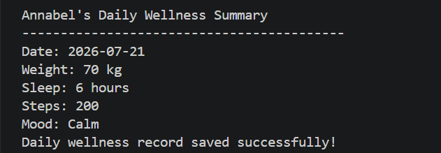

# DAILY WELLNESS TRACKER


## Overview
A beginner friendly Python application that helps users record and track their daily wellness habits. The program collects health information, validates user input, and saves each day's record to a CSV file for future tracking.

## Features

- Records the user's name
- Records daily weight (kg)
- Records sleep duration (hours)
- Records daily step count
- Records daily mood
- Validates all user inputs
- Automatically records the current date
- Saves wellness records to a CSV file
- Displays a success message after each save

## Technologies Used 
- Python
- CSV Module
- OS Module
- Datetime Module

## Project Structure 

````text
daily-wellness-tracker/ 
│ 
├── daily_wellness.py 
├── README.md 
└── daily_wellness.csv (generated automatically)
````

## Output
